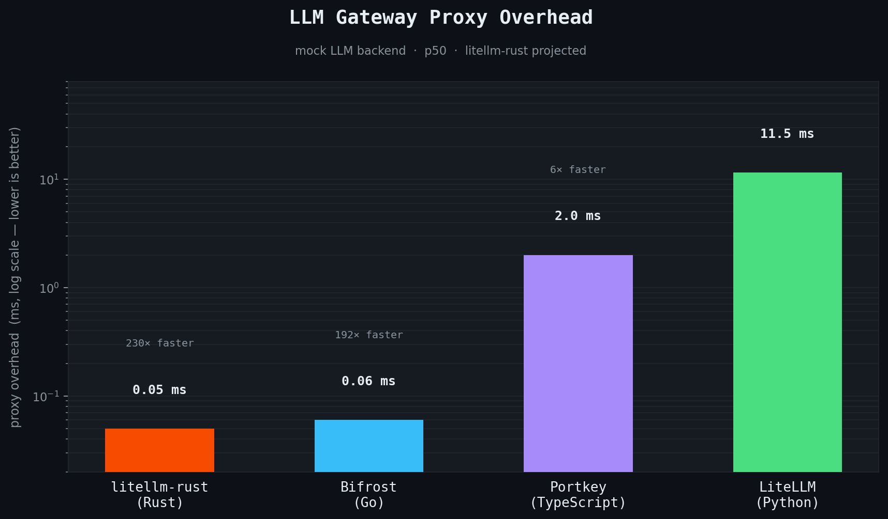

# litellm-rust
a simple and blazing fast ai gateway for giving agents access to resources (LLM's, MCP's, API's). 



## Usage with Claude code

```bash
lite claude
```

The first run prompts for your LiteLLM URL and API key, saves them to
`~/.config/lite/claude.env`, and starts Claude Code with:

```bash
ANTHROPIC_BASE_URL="https://your-litellm-rust-server.com"
ANTHROPIC_AUTH_TOKEN="$LITELLM_API_KEY"
```

Arguments after `lite claude` are forwarded to Claude Code:

```bash
lite claude --help
lite claude --model claude-sonnet-4-5
```

Run `lite claude --reset` to ignore saved settings and enter them again.

## Quickstart

litellm-rust is compatible with your existing litellm config.yaml and DB. 

```yaml
model_list:
  - model_name: gpt-4o
    litellm_params:
      model: azure/my_azure_deployment
      api_base: os.environ/AZURE_API_BASE
      api_key: "os.environ/AZURE_API_KEY"
      api_version: "2025-01-01-preview" # [OPTIONAL] litellm uses the latest azure api_version by default
```

```
$ litellm-rust --config /app/config.yaml
```

## Routes

```txt
POST /messages
POST /responses
POST /realtime
POST /audio
```

## Providers
- OpenAI
- Azure OpenAI
- VertexAI
- Bedrock

## Codebase map

`src/lib.rs` is the crate root — every top-level module must be declared here
to exist. Adding `pub mod foo;` is how a new module becomes part of the binary.

| Path | What it does |
|------|-------------|
| `src/lib.rs` | Crate root. Declares all top-level modules. |
| `src/main.rs` | Binary entry point. CLI parsing, server startup, wires all pieces into `AppState`. |
| `src/errors.rs` | Typed error enum. Maps every error variant to an HTTP status + JSON body in one place. |
| `src/model_prices.rs` | Loads the LiteLLM model cost/capability map at startup. Tries the upstream URL first; falls back to an embedded snapshot (`model_prices_backup.json`). Stored on `AppState` for all handlers. |
| `src/http/` | HTTP layer only. Route registration, request auth, body extraction, response shaping. No business logic. |
| `src/providers/` | Provider registry, request/response transformation per provider, and the model router that maps a model name to a deployment + handler. |
| `src/proxy/` | Config loading (`config.yaml`), master-key auth, and `AppState` (the shared state passed to every handler). |
| `src/cli/` | `lite claude` wizard — credential storage, model selector, Claude Code launcher. |

When adding a new top-level module, declare it in `src/lib.rs` and add a row here.

## Coding standards

See [CODING_STANDARDS.md](CODING_STANDARDS.md).
