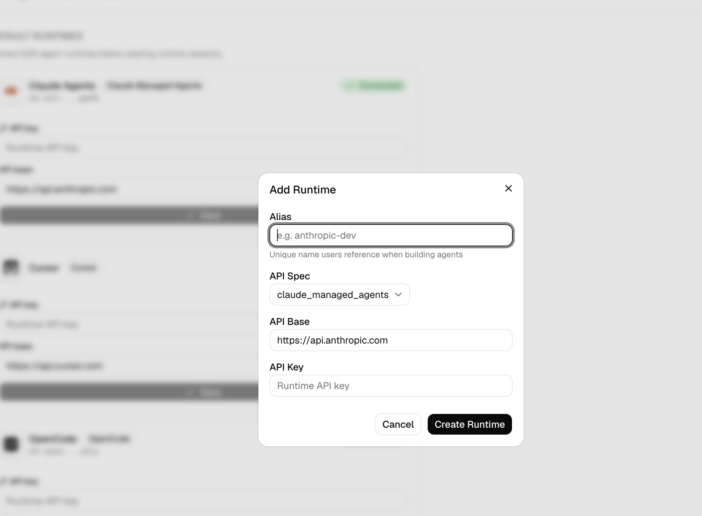
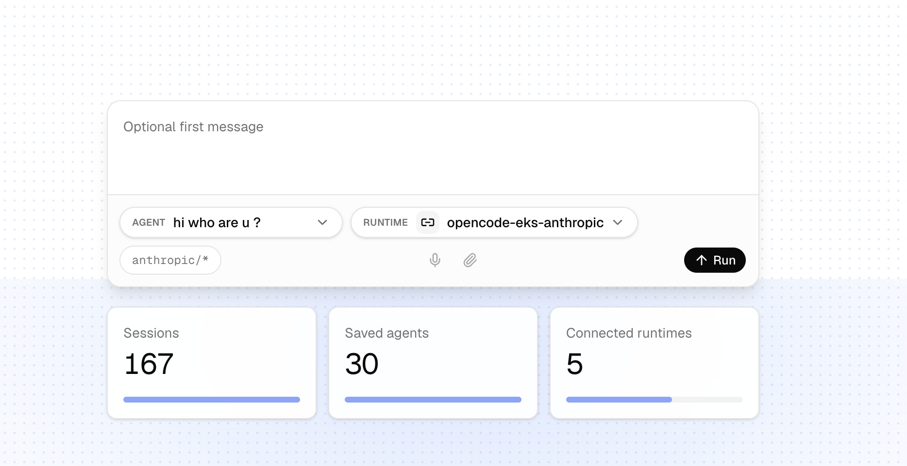
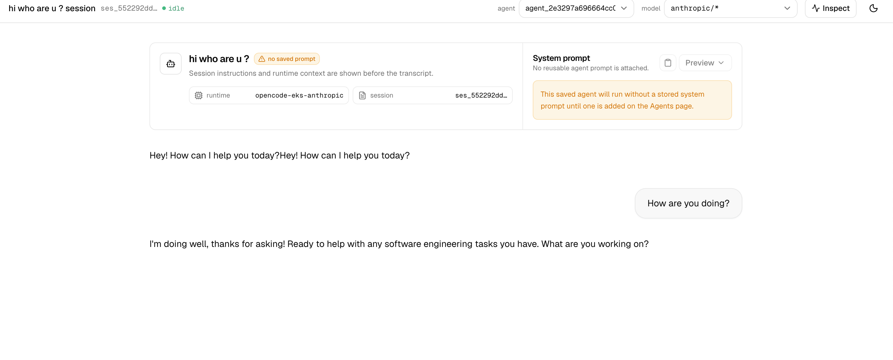

# opencode behind the Anthropic Managed Agents API

Exposes [opencode](https://opencode.ai) through the Anthropic Managed Agents API spec. Point the LAP SDK at this server — change only `api_base`/`api_key`, no new integration code.

```
┌─────────────────────────────────────────────────────────────────────────────┐
│ GKE / EKS                                                                   │
│                                                                             │
│  ┌─────────────────────┐        ┌───────────────────────┐   ┌────────────┐ │
│  │                     │        │    Agent Server       │   │            │ │
│  │  Agent Control      │───────▶│                       │──▶│  Sandbox   │ │
│  │  Plane (LAP)        │        │  opencode + Claude    │   │            │ │
│  │                     │        │        Code           │   │            │ │
│  └─────────────────────┘        └───────────────────────┘   └────────────┘ │
│                                                                             │
│                         All in their environment.                           │
└─────────────────────────────────────────────────────────────────────────────┘
```

## Quickstart

### Docker

```bash
docker build -t opencode-anthropic-server .
docker run -p 8080:8080 \
  -e LITELLM_BASE_URL=https://your-gateway/v1 \
  -e LITELLM_API_KEY=sk-... \
  -e LITELLM_MODELS=claude-sonnet-4-6 \
  opencode-anthropic-server
```

### Local

```bash
npm install
ANTHROPIC_API_KEY=sk-ant-... npm start
```

Health check: `GET /health` → `{"ok":true,"opencode":true}`

## LAP SDK

```rust
let lap = Lap::new(LapConfig {
    anthropic_api_key: Some("any-key".into()),
    anthropic_base_url: "http://localhost:8080".into(),
    ..LapConfig::default()
});

let agent = lap.beta().agents().create(CreateAgentParams {
    name: "assistant".into(),
    model: AgentModel::from("claude-sonnet-4-6"),
    system: "You are helpful.".into(),
    ..Default::default()
}).await?;

let session = lap.beta().sessions().create(CreateSessionParams {
    agent: agent.id.clone(),
    ..Default::default()
}).await?;

lap.beta().sessions().events().send(&session.id, SendEventsParams {
    events: vec![json!({"type":"user.message","content":"Hello"})],
}).await?;

let mut stream = lap.beta().sessions().events().stream(&session.id).await?;
while let Some(Ok(ev)) = stream.next().await {
    if ev.event_type == "session.status_idle" { break; }
    if ev.event_type == "agent.message" { /* print text */ }
}
```

## Environment variables

| Var | Default | Purpose |
|-----|---------|---------|
| `PORT` | `8080` | listen port |
| `WORKDIR` | `/tmp/opencode-workspace` | per-agent config directory |
| `DB_PATH` | `/data/agents.db` | SQLite agent store |
| `ANTHROPIC_API_KEY` | — | native Anthropic key (alternative to LiteLLM) |
| `LITELLM_BASE_URL` | — | LiteLLM gateway base URL (include `/v1`) |
| `LITELLM_API_KEY` | — | LiteLLM gateway key |
| `LITELLM_MODELS` | `claude-sonnet-4-6` | comma-separated models to register |
| `OPENSANDBOX_API_URL` | — | OpenSandbox controller URL (enables sandboxed execution) |
| `OPENSANDBOX_API_KEY` | — | OpenSandbox API key |
| `OPENSANDBOX_IMAGE` | — | sandbox execd image |

## Deploy on EKS with OpenSandbox

For a production deployment of opencode-anthropic-server + OpenSandbox on EKS,
see [`docs/eks-deployment.md`](docs/eks-deployment.md).

## Connect from LAP

After the EKS service is healthy, add it to the LiteLLM Agent Platform as a
custom Anthropic Managed Agents runtime.

### 1. Add the runtime

In LAP, open **AI Gateway** → **Agent Runtimes** → **Add Runtime** and create a
runtime with:

| Field | Value |
|-------|-------|
| Alias | `opencode-eks-anthropic` |
| API Spec | `claude_managed_agents` |
| API Base | `http://$LB` or the HTTPS URL in front of the EKS load balancer |
| API Key | Any non-empty placeholder, for example `fake-opencode-key` |

The opencode template honors Anthropic-style request headers but does not
validate this inbound key. LAP still needs a value so it can store a runtime
credential.



### 2. Select the runtime

Start a new LAP session, choose the saved agent you want to run, then select the
`opencode-eks-anthropic` runtime. Use the Anthropic model route shown by the UI
for this runtime.



### 3. Talk to the agent

Send a first message. The session should open against the
`opencode-eks-anthropic` runtime and stream assistant messages from the EKS
deployment.


